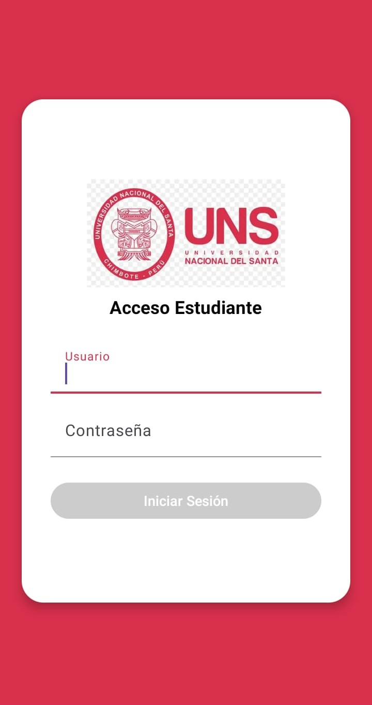
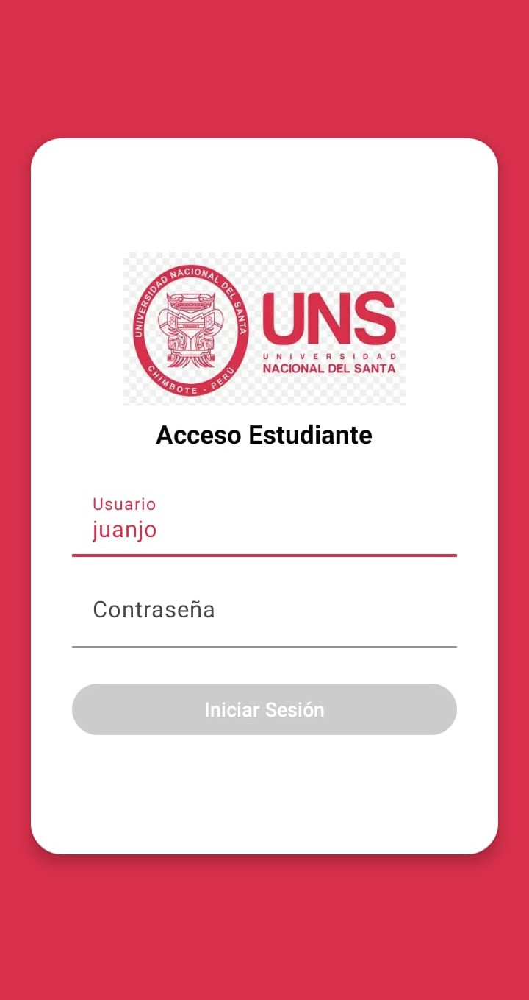
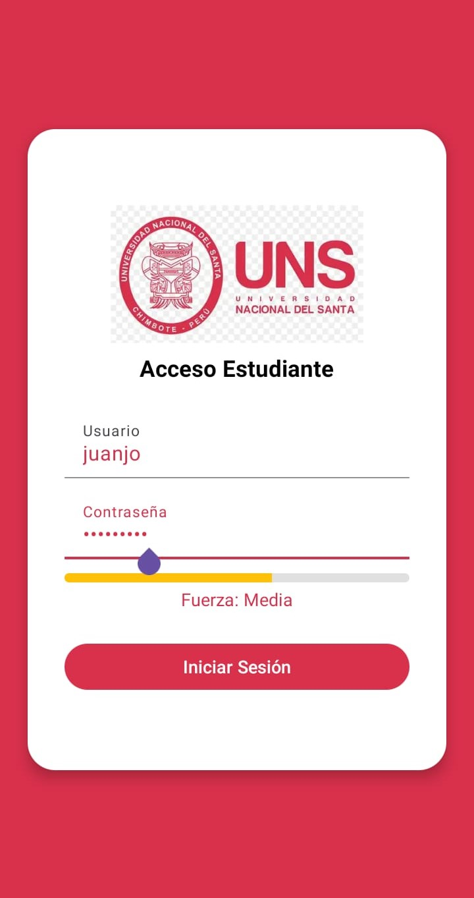
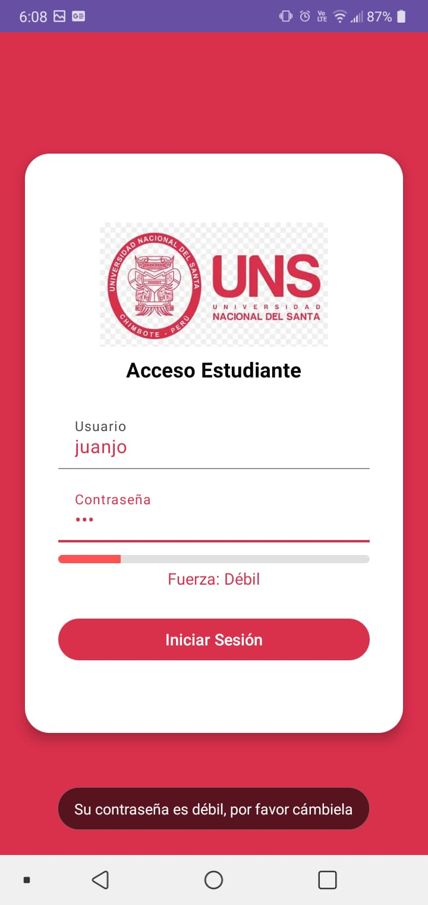
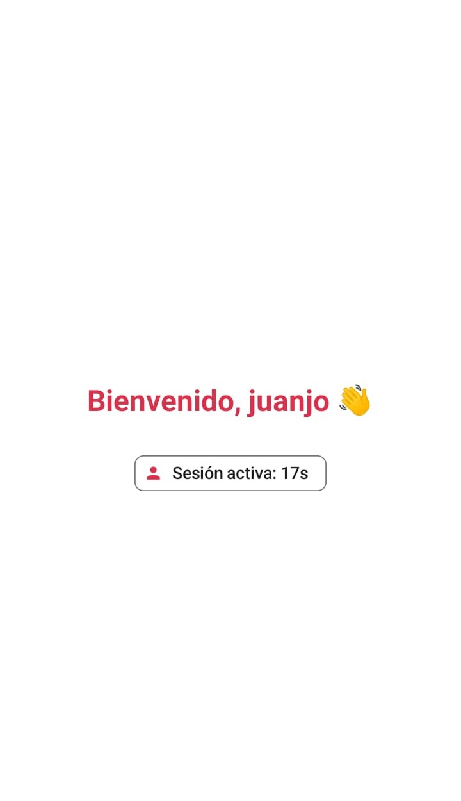

# 📱 DataLiveApp – Formulario de Login con LiveData y Material Design 3

Aplicación móvil Android que implementa un formulario de inicio de sesión con validación en tiempo real usando `LiveData`, `ViewModel` y `Material Design 3`. Además, evalúa la fuerza de la contraseña ingresada y ofrece retroalimentación visual inmediata al usuario.

---

## 🧩 Características

- 🧠 Validación de campos de usuario y contraseña en tiempo real
- 🔐 Evaluación de la fuerza de la contraseña con barra de progreso y colores dinámicos
- 🚫 Mensaje de advertencia si la contraseña es débil (Toast)
- ✅ Activación/desactivación del botón de login según validez del formulario
- 🧾 Navegación a pantalla de bienvenida tras autenticación exitosa
- 🎨 Interfaz moderna y accesible usando Material Design 3

---

## 🖼️ Capturas de pantalla

- Pantalla del login


- El botón de Iniciar Sesión estará deshabilitado hasta que el usuario rellene los dos campos


- Se mostrará un Progress Bar que indicará la fortaleza de la contraseña ingresada en tiempo real,


- Si la contraseña es débil la barra se tornará roja y mostrará un toast.


- En la siguiente pantalla se dará la bienvenida al usuario y se contará en tiempo real su tiempo de sesión en un chip.


---

## 🛠️ Tecnologías

- Kotlin
- LiveData & ViewModel (Android Jetpack)
- Material Components 3 (Material3)
- XML Layouts
- Snackbar, Toasts y ProgressBar personalizado

---

## 📁 Estructura principal

```plaintext
.
├── MainActivity.kt
├── LoginViewModel.kt
├── res/
│   ├── layout/activity_main.xml
│   ├── drawable/progress_password_fuerza.xml
│   └── values/colors.xml
├── drawable/
│   └── logo_uns.png
